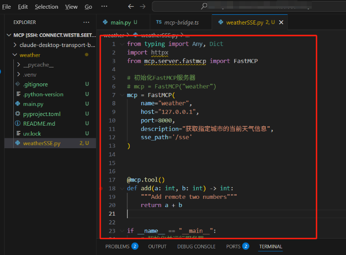
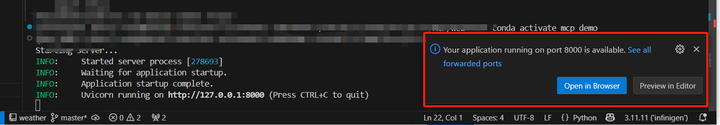
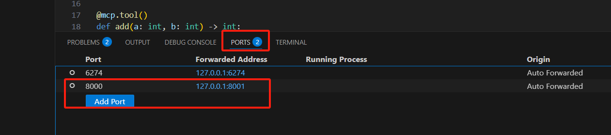
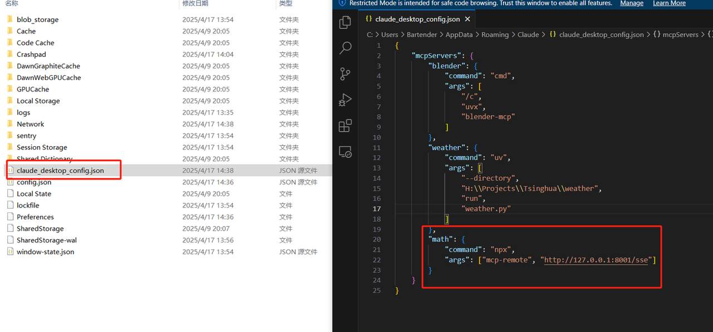
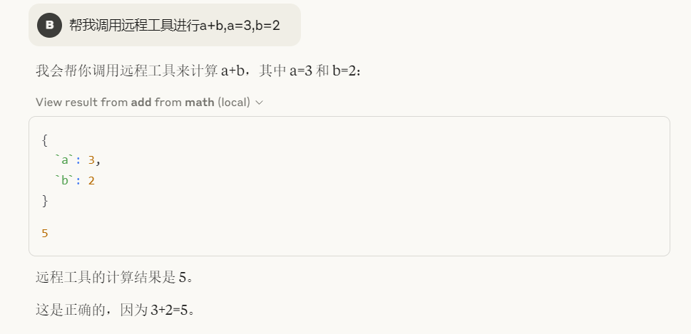
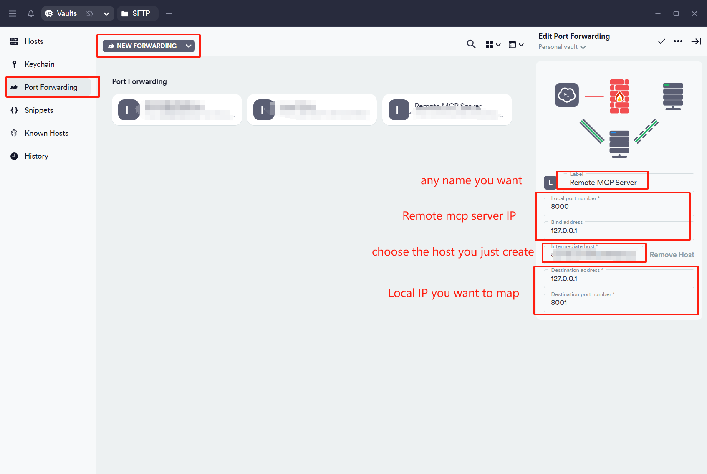
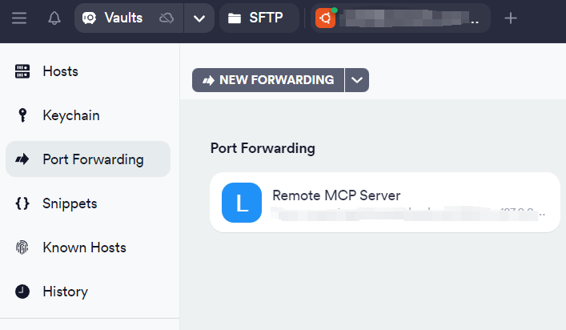

# Background
This is a tutorial for using **Win10 Claude Desktop** to communicate with the **remote mcp server** on the remote linux server.

# Tutorial
Steps:

1. Download a port forwarding tool (e.g., Termius or VSCode).

2. Deploy the MCP server on the remote server (e.g., on port 127.0.0.1:8080 of the remote server).

3. Use port forwarding to map the remote server's port to your local port (e.g., map 127.0.0.1:8080 on the remote server to 127.0.0.1:8081 on your local machine).

4. Allow Claude Desktop to access the local port 127.0.0.1:8081. This setup enables it to communicate with the MCP server on the remote server as if it were local.

## 1. Environment
SSH your remote linux server, then create environment for mcp:

```
conda create -n mcp_demo python=3.10
conda activate mcp_demo 
pip install mcp openai python-dotenv mcp[cli]
```

## 2.Use VSCode for Port Forwarding
SSH your server. Create any Python file (e.g. weatherSSE.py) and typing the following MCP server code in the highlighted section:

```
from typing import Any, Dict
import httpx
from mcp.server.fastmcp import FastMCP

mcp = FastMCP(
    name="weather",
    host="127.0.0.1",
    port=8000,
    description="simple add function",
    sse_path='/sse'
)

@mcp.tool()
def add(a: int, b: int) -> int:
    """Add remote two numbers"""
    return a + b

if __name__ == "__main__":
    # init and start server
    try:
        print("Starting server...")
        mcp.run(transport='sse')
    except Exception as e:
        print(f"Error: {e}")
```

then run:
```
python weatherSSE.py
```

if anything work successfully, you will see the server is running on the 127.0.0.1:8080:


and you can see VSCode automatically mapped 127.0.0.1:8000 on the remote server to 127.0.0.1:8001 on the local machine.


Now go back to your Windows Claude Desktop, click File->Setting->Developer->Edit Config, and edit the json file:


```
"math": {
            "command": "npx",
            "args": ["mcp-remote", "http://127.0.0.1:8001/sse"]
        }
```

now you can ask the Claude Desktop question:
Use a tool to help me calculate: if a = 1 and b = 2, what is a + b?


Claude Desktop successfully invoked the tool deployed on the server hosted on the Linux machine. Due to port forwarding, accessing 127.0.0.1:8081 locally is equivalent to accessing the MCP server at 127.0.0.1:8080 on the remote server.

## (Optional)Use Termius for Port Forwarding
If VSCode cannot automatically perform port forwarding for you, you can use a free tool like Termius(https://www.termius.com/) to achieve port forwarding.

Create your new host, fill in your SSH connection details:


(Here, we assume that you have already set up the MCP environment and written the MCP server code.)

Click Port Forwarding, create a port forwarding rul,fill in the required information:


Double-click the rule to activate it. If the rule icon turns blue, it indicates that the rule is working:


now you can ask the Claude Desktop question:
Use a tool to help me calculate: if a = 1 and b = 2, what is a + b?
